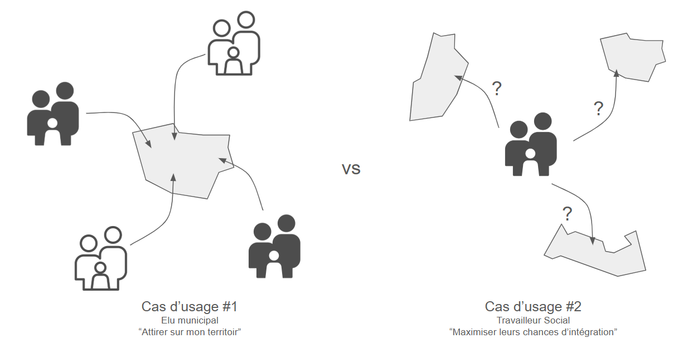
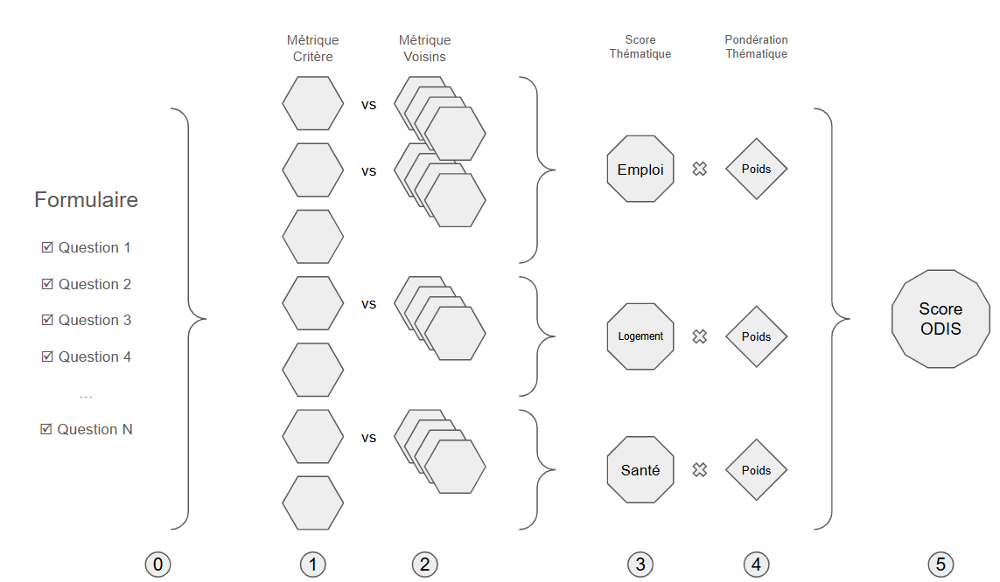
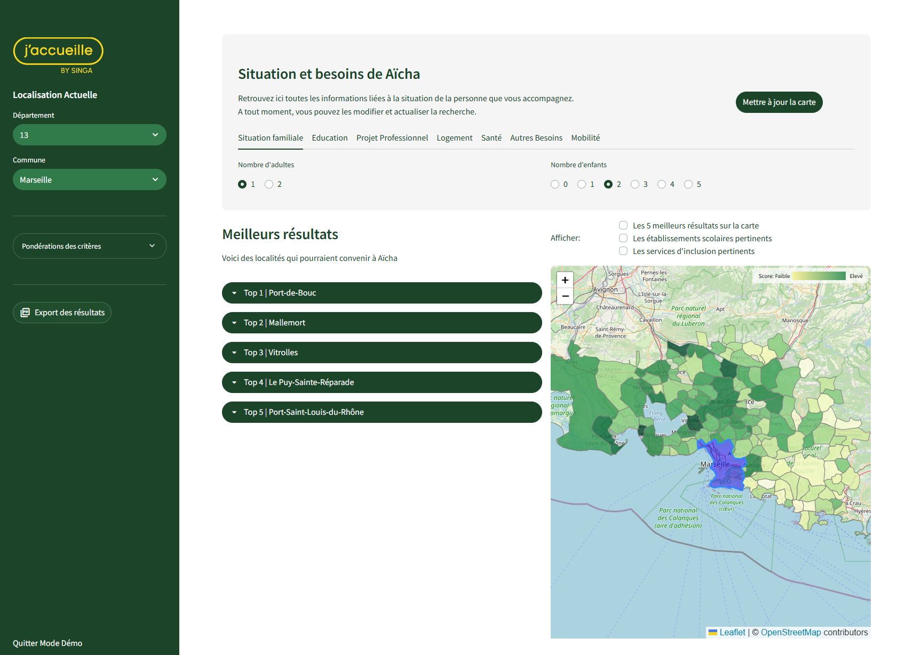
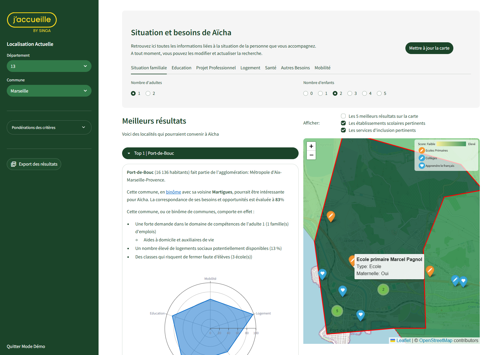

# OD&IS Prototype du Stream 2: Recherche Inversée

## Contexte du projet
Ce projet est une extension du projet principal: [13_odis](https://github.com/dataforgoodfr/13_odis) qui est communément appelé le "Stream 1". Ce premier projet consiste à améliorer la data platform soutenant une application existante d'exploration et de comparaison d'indicateurs d'une commune sélectionnée dans le context de l'inclusion sociale.

Le Stream 2 consiste en une exploration pour un autre cas d'usage autour des mêmes données: rechercher des localités pertinentes pour la relocalisation de personnes ou familles nouvellement arrivées en France. Cette fois-ci on part de la personne accompagnée d'où le nom de "recherche inversée".

Plus précisemment le projet consistait en deux livrables:
- Des maquettes présentant un outil cible de recherche de localités selon un projet de vie spécifique
- Un prototype présentant des résultats de cette recherche identifés par une notation (scoring) des localités dans la zone de recherche selon les préférences de la ou des personnes accompagnées.

Le persona principal pour cette application est le ou la travailleur.e social.e 

## Objectifs du prototype

Le prototype dont le code est partagé dans ce repertoire a un triple objectif :
1. Valider la pertinence de l'approche auprès de futurs utilisateurs
2. Démontrer de notre capacité à mettre en avant des résultats pertinents en utilisant les données ouvertes disponibles
3. Promouvoir l'intéret de cette approche auprès de décideurs et donateurs potentiels 

## Approche technique

Le prototype est construit en trois parties:
1. Un Notebook Jupyter [odis_stream2_data_gathering.ipynb](../notebooks/odis_stream2_data_gathering.ipynb) qui aggrège un certains nombres de datasets issue des base de données ouverte type [Data Gouv](data.gouv.fr) (voir Data Gathering ci-dessous)

2. Un Notebook Jupyter [odis_stream2_scoring.ipynb](../notebooks/odis_stream2_scoring.ipynb) qui contient toutes la logique pour établir un score pour chaque localité (voir Scoring ci-dessous)

3. D'une application basée sur le framework Streamlit qui permet de définir des critères de recherches et de visualiser les résultats (voir Streamlit App ci-dessous)

### Data gathering

Dans le cadre de ce prototype, l'étape de Data Gathering est très simple:
- Des données sont récupérées au format CSV (essentiellement depuis data.gouv.fr). Elles sont stockées dans deux repertoires: csv qui est synchronisé avec Github et csv_large qui n'est pas synchronisé car les fichiers sont trop volumineux --> il faudra retélécharger les données à la main
- Les données sont ensuites nettoyées, aggrégées (Mega Merge) par commune
- Un dataset `principal odis_june_2025_jacques.parquet` est généré au format parquet et réutilisé par la suite. Il est disponible dans le dossier ../csv/  

> Note: le code pour le data gathering est dans le Notebook `odis_stream2_data_gathering.ipynb`

### Scoring

Le but du scoring est de noter chaque localité entre 0 et 100, 100 étant la note maximale et correspond à la meilleur correspondance avec les préférences (= projet de vie) exprimées dans le formulaire.

Une **localité** peut correspondre soit à une commune en particulier (autrement appelé monôme dans le code) ou un binôme de deux communes limitrophes. L'idée est de ne pas se restreindre à un découpage administratif qui exclurait artificiellement des opportunités "de l'autre côté de la rue". 

Dans la pratique cela veut dire que l'on établit un score pour chaque commune ainsi que pour tous les couples consitutés avec chaque commune voisine. On ajoute néanmoins un paramètre ajustable de pénalité `binome_penalty` pour privilégier les options de type monôme (tous les besoins sont couverts dans la même commune).

> Note: le code du scoring est dans le Notebook `odis_stream2_scoring.ipynb` cependant il est manuellement exporté en fichier python `odis_stream2_scoring.py` depuis le notebook.

L'approche est volontairement très simple (pour commencer) et peut se décrire en 5 étapes:
0. On récupère les préférences exprimées dans le formulaires qui sont stockées dans un dict `prefs`
1. Selon les préférences on calcule un score pour chaque critère pertinent (ex. on ignore les critères de la catégorie éducation s'il n'y a pas d'enfants). Ce score par critère est normalisé sous forme de centiles pour la zone de recherche (score entre 0 et 100).
2. On compare ensuite avec les scores de tous les voisins (pondérés par la pénalité) pour garder le meilleur score
3. La meilleure combinaison est moyennée par catégorie de critères. Cette catégorisation, ainsi que d'autres éléments de configuration des scores de critères, sont définis dans le fichier `odis_scores_cat.csv` (dossier ../csv/)
4. On associe à chaque catégorie une pondération qui reflète l'importance d'une catégorie par rapport à une autre (il n'y a pas de pondération au niveau de chaque critère au sein d'une catégorie)
5. On effectue une moyenne pondérée par catégorie, trie les résultats et garde le meilleur résultat pour chaque commune qui nous donne un `odis score` entre 0 et 100 qui est utilisé par la suite

Dans le code voici les étapes:
1. On stocke les préférences dans `prefs` et on rçupère les catégorisations de critères du fichier de configuration `odis_scores_cat.csv`
2. On  calcul la distance de chaque commune par rapport à la commune actuelle de la personne accompagnéee `add_distance_to_current_loc`
3. On filtre pour ne garder que les communes qui sont dans le rayon de recherche
`filter_loc_by_distance`
4. On calcule tous les scores pour chaque commune pour chaque critère pertinent `compute_criteria_scores`
5. Pour chaque commune on ajoute toutes les données pour chacune de ses voisines `adding_score_voisins`
6. On calcule les scores pour chaque catégorie de critères en comparant les scores de critères deux à deux entre la commune et sa voisine (en incluant la pénalité) et en gardant la meilleure option avec la fonction `compute_cat_scores`
7. On cacul le score pondéré final selont les préférences de pondération dans `prefs`
avec la fonction `compute_binome_score`
8. On trie et garde la meilleure option pour chaque commune (binôme ou monôme) avec `best_score_compute`

Voici la liste des critères utilisés dans le cadre de ce prototype:
> Note: ce choix de critères est totalement arbitraire (motivé par nos discussions avec J'Accueille et la disponibilité des données) et doit être revisité !

- met_scaled: Taux Besoin Emploi
- met_tension_scaled: Taux Besoin Emploi en Tension
- svc_incl_scaled: Taux Services Inclusion
- log_vac_scaled: Taux Logements Vacants
- log_soc_inoc_scaled: Taux de Logements Sociaux Inoccupés (Vacants ou Vides)
- log_5p_scaled: Taux Grandes Résidences Principales
- classes_ferm_scaled: Taux Classes à Risque de Fermeture
- pol_scaled: Couleur Politique de la commmue
- met_match_adult1_scaled: Match compétences et Besoin Emploi Adult 1
- met_match_adult2_scaled: Match compétences et Besoin Emploi Adult 2
- form_match_adult1_scaled: Match besoins et Centres de formation
- form_match_adult2_scaled: Match besoins et Centres de formation
- reloc_dist_scaled: Distance de la localisation actuelle
- reloc_epci_scaled: Même agglomération que la localisation actuelle
- besoins_match_scaled: Présence de solutions de soutien spécifiques

### Streamlit App

Rendu du prototype de l'application à la fin juin 2025
|| | 
| ----------- | ----------- |
|Page résultats|Détail d'un résultat|

#### Formulaire

#### Meilleurs Résultats

#### Carte

## Limites du prototype
