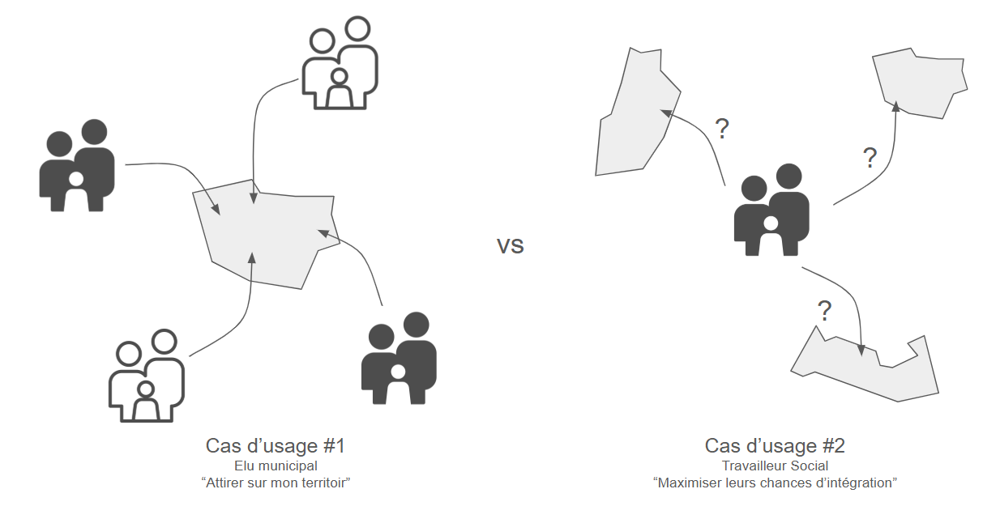
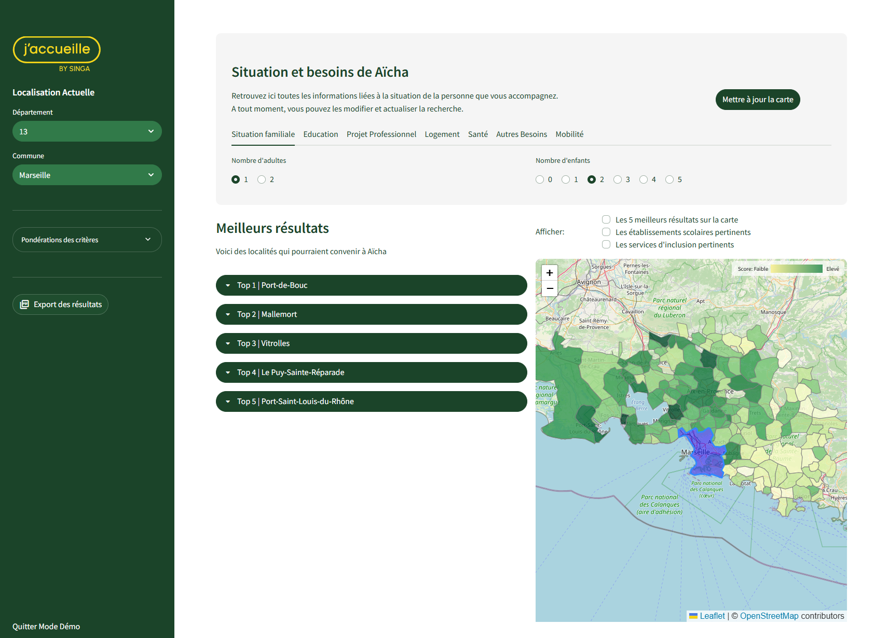
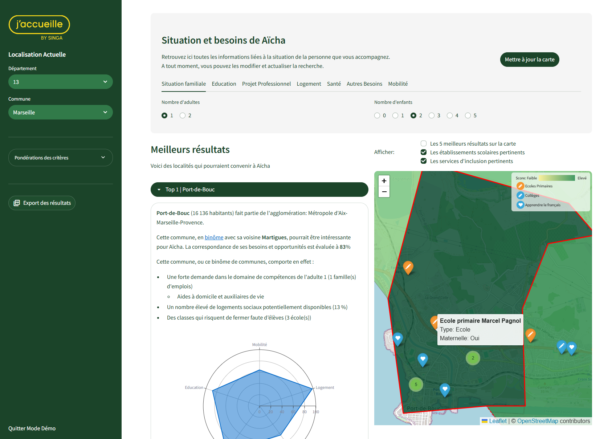
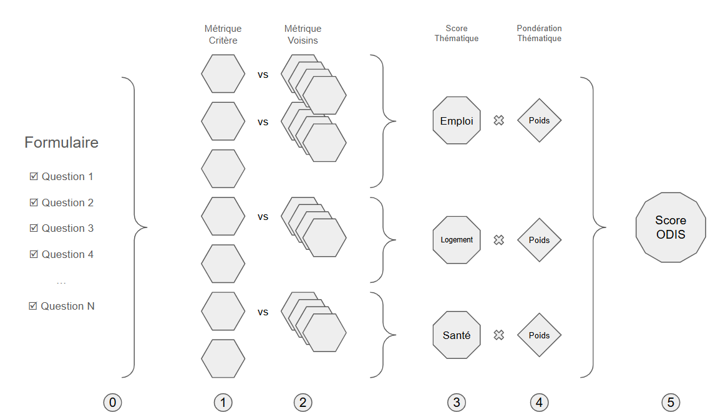

# OD&IS - Prototype d'Aide à la Localisation (Recherche Inversée)

[](https://www.python.org/downloads/release/python-3100/)
[](https://streamlit.io)
[](../../LICENSE)

## 🎯 Contexte et Objectifs du Projet

Ce projet, surnommé **"Stream 2"**, est un prototype fonctionnel explorant une approche de **"recherche inversée"** pour l'aide à la relocalisation des personnes et familles accompagnées par des structures d'insertion comme [J'accueille](https://www.jaccueille.fr/) ou [SINGA](https://www.singafrance.com/).

Il s'inscrit en complément du projet principal [13_odis](https://github.com/dataforgoodfr/13_odis) (ou "Stream 1"), qui se concentre sur l'exploration et la comparaison d'indicateurs pour une commune déjà sélectionnée.

L'innovation de ce prototype est de renverser la logique : au lieu de partir d'un lieu, **on part des besoins et du projet de vie de la personne**. Le persona principal est le travailleur social qui, à travers cet outil, peut identifier les territoires les plus prometteurs pour la réussite d'un projet d'intégration.



Ce prototype a un triple objectif :
1.  **Valider la pertinence de l'approche** auprès des futurs utilisateurs (travailleurs sociaux, accompagnants).
2.  **Démontrer la faisabilité technique** de construire un score de pertinence en utilisant exclusivement des données ouvertes (Open Data).
3.  **Promouvoir l'intérêt de cette démarche** auprès de potentiels partenaires, décideurs et financeurs.

## ✨ Fonctionnalités Principales

*   **Profil Personnalisé :** Définissez un "projet de vie" détaillé incluant la composition du foyer, le niveau scolaire des enfants, les métiers visés, les besoins en formation, etc.
*   **Pondération des Critères :** Ajustez l'importance de chaque grande catégorie (emploi, logement, éducation, inclusion) pour l'adapter aux priorités de chaque projet.
*   **Scoring Intelligent :** Chaque commune de France est évaluée sur sa compatibilité avec le profil, en s'appuyant sur une multitude de sources de données ouvertes.
*   **Système de "Binômes" :** L'algorithme associe de manière unique des communes voisines (`binômes`) pour proposer des solutions conjointes qui répondent à l'ensemble des besoins, même si une seule commune ne le pourrait pas.
*   **Carte Interactive :** Visualisez les localités les mieux notées, leur score, et superposez des couches d'informations additionnelles (écoles, établissements de santé, services d'inclusion).
*   **Résultats Détaillés :** Explorez les 5 meilleurs résultats avec une analyse de leurs points forts, un "radar" visuel des scores par catégorie, et des liens pour approfondir.
*   **Scénarios de Démonstration :** Chargez rapidement des profils pré-configurés pour découvrir le potentiel de l'outil.

## 📸 Aperçu de l'Application

| Page des résultats | Vue détaillée d'un résultat |
| :---: | :---: |
|  |  |

## 🚀 Installation et Lancement

### Prérequis

*   [Python 3.10+](https://www.python.org/)
*   [Poetry](https://python-poetry.org/docs/#installation) pour la gestion des dépendances.

### Instructions

1.  **Clonez le dépôt :**
    ```bash
    git clone https://github.com/dataforgoodfr/13_odis.git
    cd 13_odis
    ```

2.  **Installez les dépendances :**
    Ce projet utilise Poetry. Depuis la racine du projet, exécutez :
    ```bash
    poetry install
    ```

3.  **Lancez l'application Streamlit :**
    Le fichier principal de l'application se trouve dans `eda/streamlit/`.
    ```bash
    poetry run streamlit run eda/streamlit/main.py
    ```
    L'application devrait s'ouvrir dans votre navigateur web.

## ⚙️ Fonctionnement : Le Moteur de Scoring

Le cœur de l'application est un pipeline de scoring qui évalue les communes en fonction du profil utilisateur.

1.  **Filtrage :** Le moteur délimite d'abord la zone de recherche en fonction de la distance souhaitée par rapport au lieu de vie actuel et d'un filtre de population minimale.
2.  **Calcul des Critères :** Il calcule ensuite des dizaines de scores individuels pour chaque commune (ex: adéquation des offres d'emploi, disponibilité de logements sociaux, capacité des écoles). Ces scores sont normalisés pour permettre une comparaison équitable.
3.  **Logique de Binôme :** Le moteur identifie les communes voisines et les évalue par paires (`binôme`). Cela permet de recommander deux villes qui, ensemble, remplissent tous les critères (ex: l'une a les emplois, l'autre les logements). Une petite pénalité (`binome_penalty`) est appliquée pour privilégier les solutions au sein d'une même commune (`monôme`) lorsque c'est possible.
4.  **Agrégation par Catégorie :** Les scores des critères individuels sont ensuite moyennés pour former des scores de catégories (Emploi, Logement, Éducation, etc.).
5.  **Score Pondéré Final :** Enfin, un `weighted_score` global est calculé pour chaque commune ou binôme en appliquant les poids définis par l'utilisateur. Les résultats sont ensuite classés selon ce score final.



## 🛠️ Stack Technique

*   **Framework Applicatif :** [Streamlit](https://streamlit.io/)
*   **Analyse de Données :** [Pandas](https://pandas.pydata.org/), [GeoPandas](https://geopandas.org/), [NumPy](https://numpy.org/)
*   **Scoring & Normalisation :** [Scikit-learn](https://scikit-learn.org/)
*   **Cartographie Interactive :** [Folium](https://python-visualization.github.io/folium/) & [streamlit-folium](https://github.com/randyzwitch/streamlit-folium)
*   **Graphiques :** [Plotly Express](https://plotly.com/python/plotly-express/)
*   **Sources de Données :** Les données sont agrégées depuis de nombreuses sources ouvertes, notamment l'INSEE, Data.gouv.fr, France Travail (Pôle Emploi), etc. Le jeu de données principal est `odis_june_2025_jacques.parquet`.

## 📂 Structure du Projet

L'application Streamlit est contenue dans le répertoire `eda/streamlit/` :

```
eda/streamlit/
├── README.md          # Ce fichier
├── main.py            # Point d'entrée, gestion de l'état et mise en page
├── ui.py              # Composants de l'interface utilisateur (sidebar, onglets, etc.)
├── scoring.py         # Pipeline de scoring et de traitement des données
├── maps.py            # Fonctions pour la création des cartes Folium
├── config.py          # Chemins de fichiers, valeurs par défaut et scénarios de démo
└── *.png              # Captures d'écran pour la documentation
```

## 🔮 Feuille de Route et Améliorations Futures

Ce prototype est une base solide qui peut être grandement améliorée :

*   **⭐ Fonctionnalités :**
    *   **Comptes Utilisateurs :** Permettre de sauvegarder, nommer et gérer plusieurs scénarios de "projets de vie".
    *   **Export PDF :** Implémenter un export propre et imprimable de la synthèse des résultats.
    *   **Filtres Avancés :** Ajouter des filtres plus fins (ex: exclure certaines régions, filtrer par couleur politique).
    *   **Comparaison des Résultats :** Ajouter une fonction pour comparer 2 ou 3 des meilleurs résultats côte à côte.

*   **📊 Données & Scoring :**
    *   **Étendre les Sources de Données :** Intégrer plus de jeux de données (transports en commun, services de santé spécifiques, activités culturelles).
    *   **Fraîcheur des Données :** Mettre en place un pipeline pour mettre à jour automatiquement les données sous-jacentes.
    *   **Affiner les Critères :** Travailler avec des travailleurs sociaux pour affiner la liste des critères et leur pertinence.

*   **💻 Technique & UX :**
    *   **Refactoring du Scoring :** La logique de scoring, actuellement dans un fichier Python exporté d'un notebook, mériterait d'être réécrite dans une bibliothèque plus modulaire et testable.
    *   **Tests :** Ajouter des tests unitaires et d'intégration pour fiabiliser le pipeline de scoring et l'interface.
    *   **Performance :** Optimiser le chargement des données et les calculs de score pour une meilleure fluidité.
    *   **Design UI/UX :** Améliorer le design visuel, la mise en page et l'ergonomie sur mobile.

## ⚖️ Licence

Ce projet est sous licence MIT. Consultez le fichier [LICENSE](../../LICENSE) à la racine du projet pour plus de détails.
